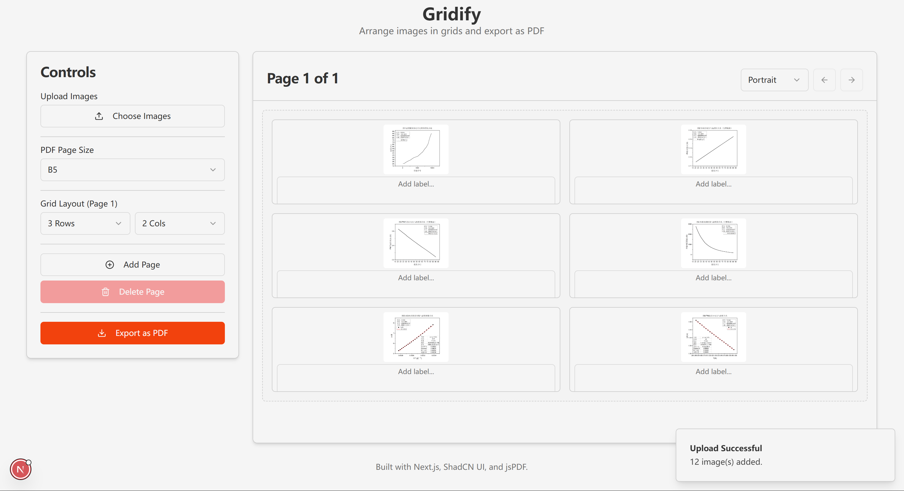

  

# Gridify

Online tool to grid-align images and export to pdf.

## Features

Short story: I got bored of manually aligning images for every physics experiment report, so I asked Gemini to help me out.

  

*   **🖼️ Easy Image Upload:** Click in any cell to upload images, easy as that!
*   **📐 Flexible Grid Layout:** You decide how many rows and columns you need. Want a 2x3 grid? A 5x4? Go for it!
*   **📄 Page Setup:** Choose standard page sizes (like A4, Letter) and orientation (portrait or landscape) to fit your needs.
*   **📥 Pdf Export:** Once your grid looks perfect, hit the export button and get a neatly formatted PDF document. Great for sharing or printing.
<!-- Waiting for deployment -->
<!-- *   **🚀 Lightweight & Online:** Nothing to install. Just open the webpage and start gridifying. -->
*   **✨ Clean Interface:** Only the essentials to get the job done quickly. Nothing else.

## Acknowledgements

This project was made possible by the following resources. Shout out to them all!

- <a href="https://nextjs.org/" title="Next.js">Next.js</a> The React Framework for the Web.
- <a href="https://ui.shadcn.com/" title="shadcn/ui">shadcn/ui</a> for the amazing UI components.
- <a href="https://github.com/parallax/jsPDF" title="jsPDF">jsPDF</a> for fast PDF generation.
- <a href="https://peckconsulting.s3.amazonaws.com/fontconverter/fontconverter.html" title="fontconverter">fontconverter</a> for converting fonts to base64.
- <a href="https://firebase.studio/">Firebase Studio</a> for Gemini powered code.
- <a href="https://www.flaticon.com/free-icons/layout" title="layout icons">iconsax on Flaticon</a> for the wonderful logo of the project.